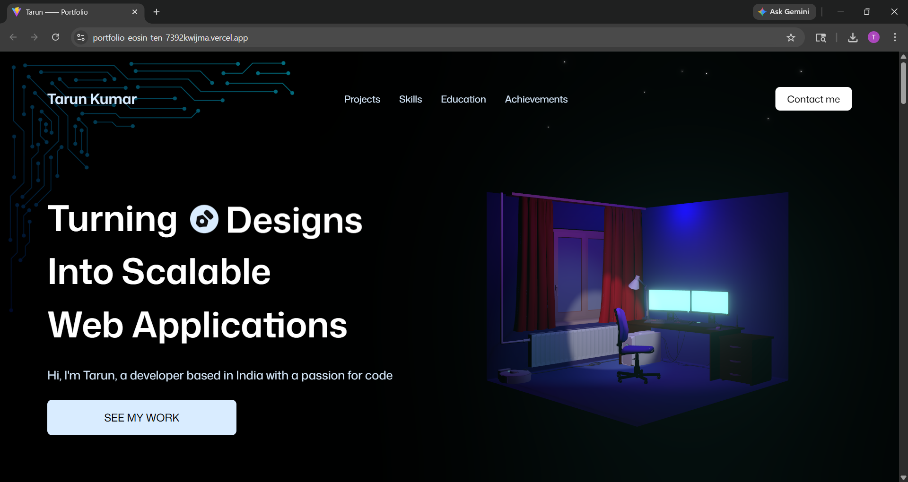
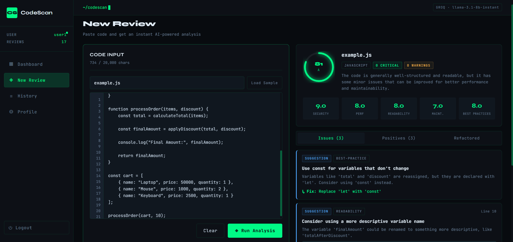
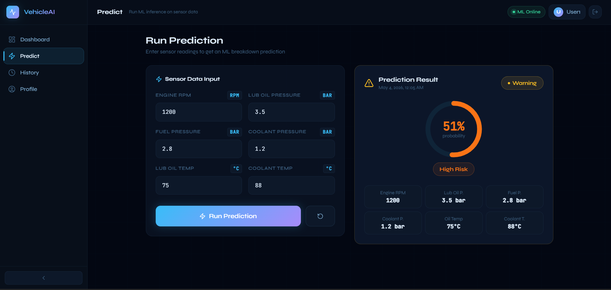
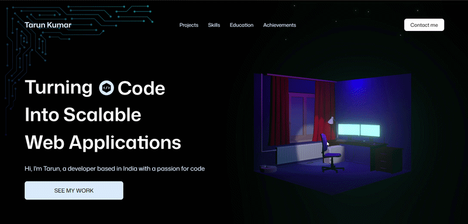
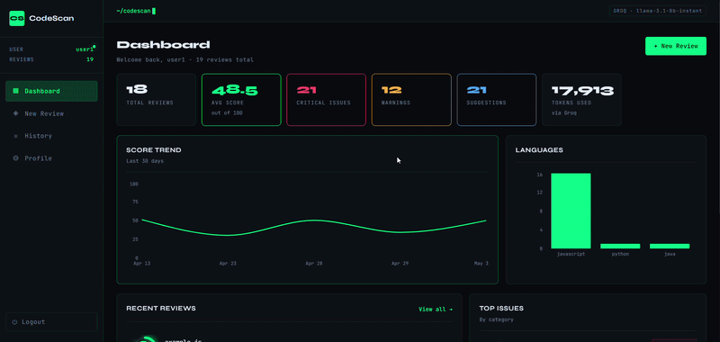

# Portfolio Website

A modern and responsive developer portfolio built to showcase my projects, technical skills, and experience in web development, machine learning integration, and full-stack applications.

---

## 🚀 Features

- Responsive modern UI
- Interactive project showcase
- Smooth animations and transitions
- Skills and technology section
- Contact section
- GitHub and social links
- Fast and optimized performance

---

## 🛠️ Tech Stack

### Frontend
- React.js
- Vite
- Tailwind CSS
- JavaScript

### Libraries & Tools
- React Icons
- Framer Motion
- Three.js
- Git & GitHub

---

## 📂 Featured Projects

### AI Code Reviewer
An AI-powered code analysis platform that reviews source code for bugs, performance issues, and best practices.

### Vehicle Breakdown Prediction System
A machine learning–based system that predicts vehicle failures using telemetry and maintenance data.

### Doctor Appointment App
A full-stack healthcare platform for booking and managing doctor appointments.

---

## 🌐 Live Deployments

### Portfolio Website
🔗 **Live Demo:**  
https://portfolio-eosin-ten-7392kwijma.vercel.app 

### AI Code Reviewer
🔗 **Live Demo:**  
https://ai-code-reviewer-pi-tawny.vercel.app

### Vehicle Breakdown Prediction System
🔗 **Live Demo:**  
https://vehicle-prediction.vercel.app

### Doctor Appointment App
🔗 **Live Demo:**  
https://doctor-appointment-app-seven-ivory.vercel.app

---

## 📦 Source Code

- **Portfolio Repository:**  
  https://github.com/Tarun-7092/portfolio

- **More Projects:**  
  https://github.com/Tarun-7092

---

## 🖼️ Screenshots

### Portfolio Homepage

### AI Code Reviewer

### Vehicle Breakdown Prediction

---

## 🎥 GIF Previews

### Portfolio Animation

### AI Review Demo

## 📬 Contact

**Tarun Kumar**

- Email: tarun7488kumar@gmail.com
- GitHub: https://github.com/Tarun-7092
- LinkedIn: https://www.linkedin.com/in/tarun-kumar32/
---

## 📄 License

This project is open source and available under the MIT License.